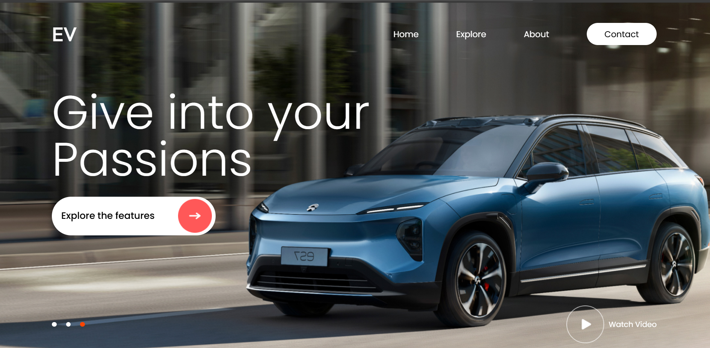

# ⚡ EV Showcase Website

A modern and responsive electric vehicle (EV) website built using **React.js**. This project showcases a sleek UI with a hero section, auto image slider after every 3 seconds, and elements to engage users. ###(Additinal features are yet to added, this is the initial web design with some working features)

## 🚀 Features

- Responsive homepage layout
- Hero section with bold text and call-to-action button
- Image slider with dot navigation
- Functional Video play button
- Clean, professional design using modern CSS

## 🖼️ Preview

##Website Link:
https://hemanthnagaraj04.github.io/EV-Website/

## 📦 Tech Stack

- React.js
- HTML5 & CSS3
- JavaScript (ES6+)

